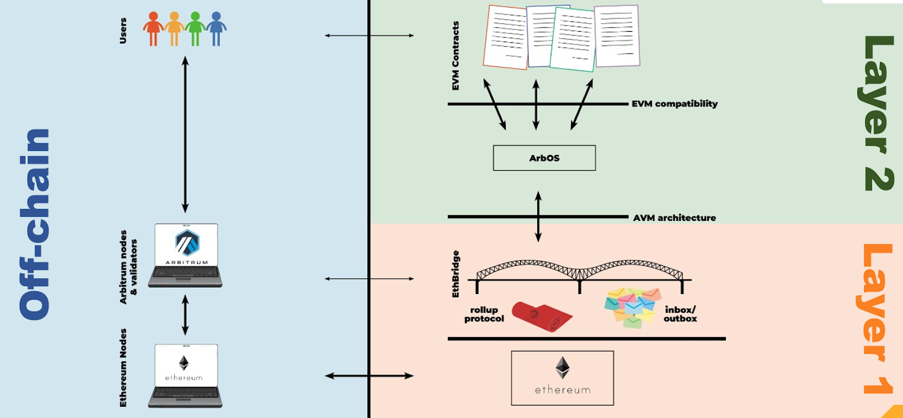

# Arbitrum_FAQ

# 以太坊扩容与Layer2
## 以太坊为什么要扩容？
以太坊每秒仅支持十几笔交易，单笔交易成本高昂，已经无法满足日益增长的DeFi、游戏的需求，以太坊扩容的呼声越来越高，同时也涌现出了各种形式的扩容方案。

## 什么是 Optimistic Rollup?
Rollup是一种扩容方案。在rollup中，将存储与运算从以太坊上剥离，在Layer2上执行，仅将交易的密码学凭据发送至以太坊。在安全性扎根以太坊的前提下，提升了交易速度也节省了燃气费。

Optimistic Rollup是一种乐观式的rollup，也即所有的状态发布时都不包含任何有效性的证明。相反，验证者在当在以太坊链上发布一个断言时同时要质押一笔资金，如果有人认为该断言是错误的，在一段时间窗口内任何人都可以质押自己的资金并挑战该断言。有时我们称这种模式为『欺诈证明』。如果断言者是错误的，他会失去自己的质押资金。如果在挑战期过期后仍没有成功的挑战，该断言就会被接受并最终定格。

## 什么是Arbitrum？
Arbitrum是一套高TPS，低使用成本且无需信任的以太坊Optimistic Rollup扩容方案。

它拥有独特的特性集：
* 无需信任的安全性：安全扎根于以太坊，任何人都可以确保正确的L2结果
* 以太坊兼容性：所有EVM标准的合约和转账都可以在Arbitrum上执行
* 可扩展性：将以太坊的计算和存储转移至链下，吞吐量更高
* 最低成本：为最小化以太坊L1燃气成本而生，降低每笔交易的成本

## Arbitrum 上理论交易速度能达到多少？
我们的测试显示，Arbitrum大约每秒可执行4500条交易。

## 有了ETH 2.0 吗还需要Arbitrum吗？
以太坊内部进行扩容的性能解决方案，而Layer 2则是在以太坊区块链外部进行扩容的方案。
Eth2.0没有提供以太坊无限的可扩展性。现在急需以太坊的可扩容性。由ETH 2.0带来的TPS仍然不能满足于需要链上交易的高吞吐量应用，而Layer 2实际上将建立在ETH 2.0提供的体验之上，以确保为终端用户提供更好的体验。

# 合约开发者实操问题
## 在Arbitrum上部署与编写合约与以太坊上有什么区别？
Arbitrum支持标准的EVM合约部署。这意味着标准的Solidity合约能够使用既有的开发者工具就可部署在Arbitrum链上。

虽然Arbitrum支持Solidty代码，但一些操作仍有不同，其中包括一些在L2上没太大意义的操作。详见[Solidity支持](https://github.com/dysquard/Arbitrum_Doc_CN/blob/master/5_与以太坊相比的不同点/3_Solidity支持.md)。

## 以太坊上的项目如何迁移到 Arbitrum？ 支持哪些开发语言和工具？
从以太坊向Arbitrum移植合约快速又简单，无需更改任何代码或下载新软件。Arbitrum完全支持EVM。这意味着所有以太坊上智能合约的语言（如所有版本的Solidity，Vyper Yul）同样也被Arbitrum原生支持。详细兼容性请见[Solidity支持](https://github.com/dysquard/Arbitrum_Doc_CN/blob/master/5_与以太坊相比的不同点/3_Solidity支持.md)。所有以太坊前端工具（如Truffle，Hardhat，The Graph，ether.js）也都完全支持，详见[前端集成](https://github.com/dysquard/Arbitrum_Doc_CN/blob/master/3_dapp基础/1_前端集成.md)。

## Arbitrum开发与使用文档
英文版：[Arbitrum Developer Quickstart · Offchain Labs Dev Center](https://developer.offchainlabs.com/docs/developer_quickstart)
中文版：[GitHub - dysquard/Arbitrum_Doc_CN: Arbitrum官方文档中文版](https://github.com/dysquard/Arbitrum_Doc_CN)

# Arbitrum运行原理

## Arbitrum的基本架构

左侧是用户以及用户选择的连接到区块链的服务提供者。左下方是标准的*以太坊节点*。上面的是*Arbitrum节点*。

右侧是构建于以太坊之上的Arbitrum系统。在以太坊上面是*EthBridge*，它由管理Arbitrum链的一系列以太坊上的合约组成。EthBridge仲裁Arbitrum rollup协议，维护收件箱和发件箱，以保证L2运行的正确性。

EthBridge上方的水平线是AVM，EthBridge就是通过这里与上层交流的。

再上一层是ArbOS，负责维护记录，交易管理，以及对智能合约监管。

ArbOS之上的水平层叫做EVM兼容层，因为ArbOS为智能合约提供了兼容以太坊虚拟机的执行环境。

在整个栈之上，图表的右上部分，是由开发者部署到Arbitrum上的EVM合约。

## Arbitrum中有什么用户角色？
* **Arbitrum Full Node**：Arbitrum全节点。记录并追踪Arbitrum链的状态并接受来自用户RPC调用的网络节点。类似于L1以太坊上的非挖矿节点。全节点是免许可的，任何人都可以担任该角色。

* **Aggregator**：聚合器。一种Arbitrum全节点，也会接收用户的交易并批量提交。聚合器是免许可的，任何人都可以担任该角色。

* **Sequencer**：序列器。一个特别委任的全节点，有权在收件箱中对一定时间内的交易进行重排序。因此序列器可以立即保证用户交易的结果，而不需要等待以太坊上发生任何事，如为区块确认等5分钟，也甚至不需要等以太坊上15秒一次的区块生成。

* **Validator**：验证者。质押资金并参与可争议断言的人。既可以主动发起断言更新状态，也可以监控其他验证者的断言并对错误断言进行挑战。验证者是免许可的，任何人都可以担任该角色。

* **普通用户**：顾名思义，只使用Arbitrum网络进行交易，不参与其中任何事务。

## 什么是断言？
 Assertion，断言，一种由验证者做出的关于链上合约之后行为的声明。在断言未确认之前都认为是待定状态。一系列断言组成的树代表着Arbitrum链的状态。

断言全称*可争议断言*（*Disputable Assertion* ，DA）。验证者可以发起DA。DA以某个状态哈希起始。在符合一些技术性前提的情况下，VM可以执行特定步数的运算，并带来特定的新的状态哈希。VM在该过程总会执行特定的交易并发出特定的log事件。该DA可能是有效的也可能是无效的。提出DA的一方需要质押一定资金为DA的有效性背书。

## 什么是挑战
由于Arbitrum是乐观式的rollup，所有DA在提出时都默认是对的，除非有人反对。A提出了某断言而B不认同该断言，B可以对A提出挑战。挑战的仲裁者是EthBridge。最终一名质押者会赢得比赛，输家的质押资金会被没收，其中一半奖励给赢家，另一半被销毁。

## 什么是 AnyTrust Guarantee？
AnyTrust Guarantee，『一诚则成』原理，：不论有多少恶意验证者，只要有一个诚实的验证者，整个链的正确运行都会有绝对的保障。这意味着Arbitrum链的运行是与以太坊一样免信任的。

## Arbitrum 如何做到 AnyTrust Guarantee？
Arbitrum Rollup协议的重要特性之一是免信任——只要有一方是诚实的即可迫使VM状态向正确的方向推进。

如何保证这一点呢？设想一下，Alice总是质押在正确的分支上，并在树没有新状态时提出DA。如果有人提出了错误的DA，Alice会为反对该DA进行质押。

由于Alice质押在正确的分支上，她将赢得每个争议。如果有人不同意Alice，他们要么(a)在与其他人的进行的不相关的争端中输掉，或(b)最终与Alice发生争议并输掉。不论什么情况，任何不同意Alice的人最终都会输。只有与Alice一致的人才会留下来，所以Alice的路径最终会变成有及时质押的唯一路径，并被确认。

## Arbitrum 如何收 Gas 费？
ArbGas是Arbitrum用来管理链上执行成本的。与以太坊gas的理念一致，每个AVM指令都会有一定数量的ArbGas消耗，而一次运算的总成本是该运算包含的指令的ArbGas的加总。

ArbGas并不能直接与以太坊gas相比。Arbitrum并没有硬性的ArbGas limit，正常情况下Arbitrum链每秒可以消耗任意数量的ArbGas，而在以太坊中则有gas limit。开发者和用户应该把ArbGas理解为是比以太坊gas更加
且便宜和充足的。

ArbOS管理着为验证者从用户端收集运行费用的经济模型。

## 如何快速提现，减少等待期？
当提取ETH或ERC20代币时，可以利用第三方提供的流动性来进行快速提现（可能会收取小部分服务费）。

目前有Hop，Connext等项目支持Arbitrum的快速提现。

